# Gallery Casebook

This document summarizes the built-in gallery in a longer form than the summary table.

## Uniform absolute spread

The reference experiment: exact robust bounds for |S2 - S1|.

### Configuration

- `x_interval = (1.0, 3.0)`
- `y_interval = (0.0, 4.0)`
- `n = 20`
- `payoff = abs_spread`
- `strike = 0.000000`

### Exact Results

| Lower | Upper | Width |
|---|---|---|
| 0.608724 | 0.997500 | 0.388776 |

### Smallest Regularization Level

| eps | Expected payoff | Bias to upper |
|---|---|---|
| 0.1 | 0.953833 | -0.043667 |

### Figures

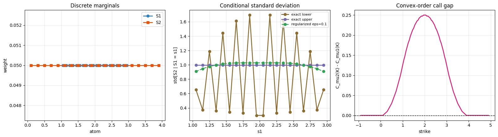

### Files

- [`uniform_abs_spread/experiment_report.md`](uniform_abs_spread/experiment_report.md)
- [`uniform_abs_spread/summary.json`](uniform_abs_spread/summary.json)

## Call on spread

A directional payoff that emphasizes upside spread scenarios.

### Configuration

- `x_interval = (1.0, 3.0)`
- `y_interval = (0.0, 4.0)`
- `n = 16`
- `payoff = call_on_spread`
- `strike = 0.250000`

### Exact Results

| Lower | Upper | Width |
|---|---|---|
| 0.189376 | 0.384103 | 0.194727 |

### Smallest Regularization Level

| eps | Expected payoff | Bias to upper |
|---|---|---|
| 0.1 | 0.346851 | -0.037252 |

### Figures

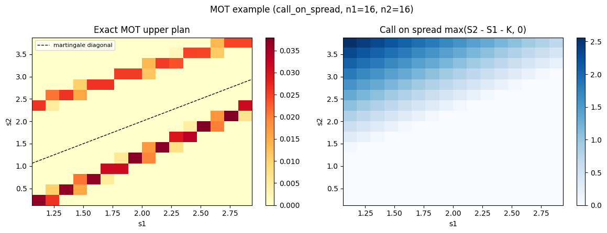

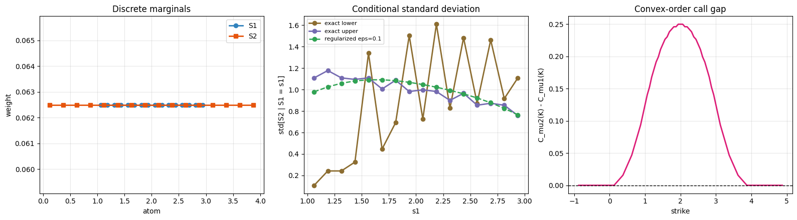

### Files

- [`call_spread/experiment_report.md`](call_spread/experiment_report.md)
- [`call_spread/summary.json`](call_spread/summary.json)

## Put on spread

The directional sibling of the call, useful when downside spread moves matter more.

### Configuration

- `x_interval = (1.0, 3.0)`
- `y_interval = (0.0, 4.0)`
- `n = 16`
- `payoff = put_on_spread`
- `strike = 0.250000`

### Exact Results

| Lower | Upper | Width |
|---|---|---|
| 0.439376 | 0.634103 | 0.194727 |

### Smallest Regularization Level

| eps | Expected payoff | Bias to upper |
|---|---|---|
| 0.1 | 0.596851 | -0.037252 |

### Figures

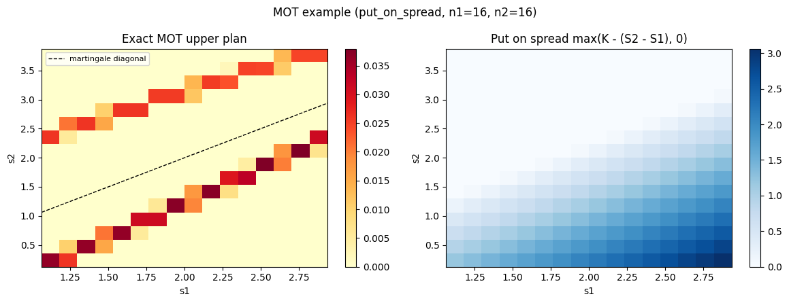

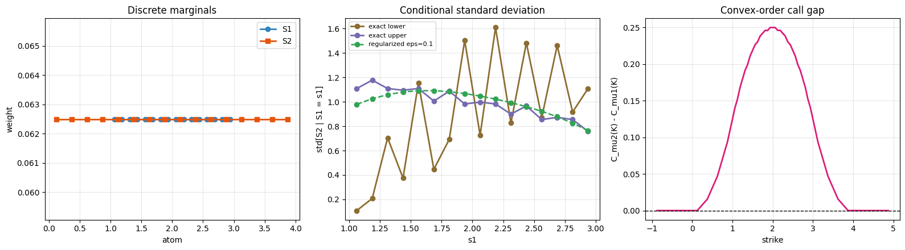

### Files

- [`put_spread/experiment_report.md`](put_spread/experiment_report.md)
- [`put_spread/summary.json`](put_spread/summary.json)

## Quadratic spread

A variance-sensitive payoff that rewards larger deviations quadratically.

### Configuration

- `x_interval = (1.0, 3.0)`
- `y_interval = (0.0, 4.0)`
- `n = 18`
- `payoff = squared_distance`
- `strike = 0.000000`

### Exact Results

| Lower | Upper | Width |
|---|---|---|
| 0.996914 | 0.996914 | 0.000000 |

### Smallest Regularization Level

| eps | Expected payoff | Bias to upper |
|---|---|---|
| 0.15 | 0.996914 | +0.000000 |

### Figures

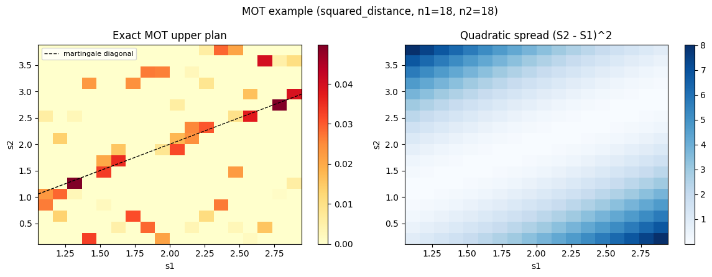

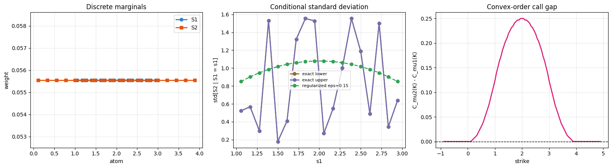

### Files

- [`quadratic_spread/experiment_report.md`](quadratic_spread/experiment_report.md)
- [`quadratic_spread/summary.json`](quadratic_spread/summary.json)

## Centered spread straddle

A symmetric payoff on a centered martingale system with wider second-step risk.

### Configuration

- `x_interval = (-1.0, 1.0)`
- `y_interval = (-2.0, 2.0)`
- `n = 18`
- `payoff = straddle_on_spread`
- `strike = 0.500000`

### Exact Results

| Lower | Upper | Width |
|---|---|---|
| 0.673894 | 1.089403 | 0.415509 |

### Smallest Regularization Level

| eps | Expected payoff | Bias to upper |
|---|---|---|
| 0.15 | 1.028888 | -0.060516 |

### Figures

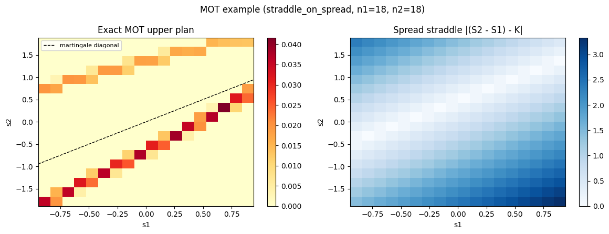

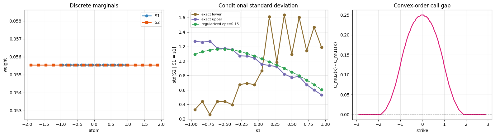

### Files

- [`centered_straddle/experiment_report.md`](centered_straddle/experiment_report.md)
- [`centered_straddle/summary.json`](centered_straddle/summary.json)

## Centered call on spread

A centered setup where upward spread moves still matter, but the geometry is more symmetric.

### Configuration

- `x_interval = (-1.0, 1.0)`
- `y_interval = (-2.0, 2.0)`
- `n = 18`
- `payoff = call_on_spread`
- `strike = 0.500000`

### Exact Results

| Lower | Upper | Width |
|---|---|---|
| 0.086947 | 0.294702 | 0.207755 |

### Smallest Regularization Level

| eps | Expected payoff | Bias to upper |
|---|---|---|
| 0.15 | 0.246243 | -0.048459 |

### Figures

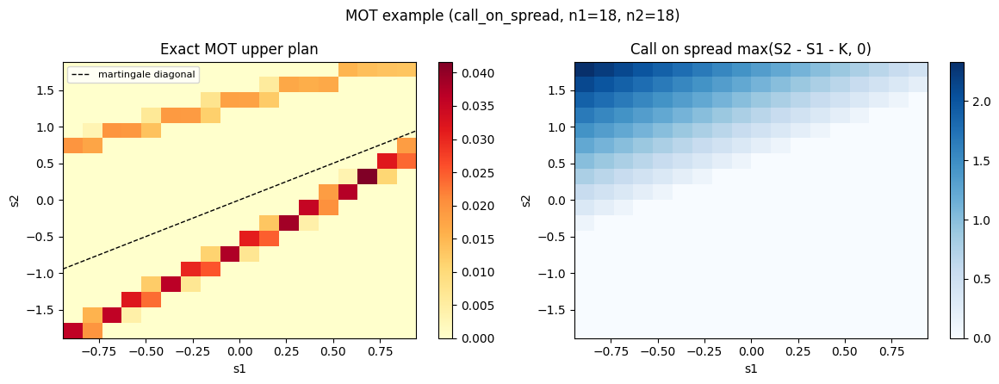

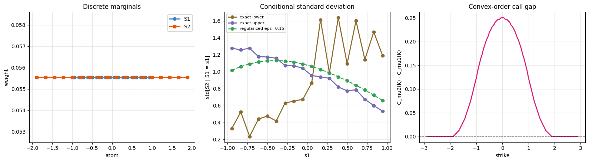

### Files

- [`centered_call/experiment_report.md`](centered_call/experiment_report.md)
- [`centered_call/summary.json`](centered_call/summary.json)

## Wide absolute spread

The reference absolute-spread experiment with a noticeably wider second marginal and a larger robust interval.

### Configuration

- `x_interval = (0.0, 2.0)`
- `y_interval = (-1.5, 3.5)`
- `n = 18`
- `payoff = abs_spread`
- `strike = 0.000000`

### Exact Results

| Lower | Upper | Width |
|---|---|---|
| 0.875361 | 1.310082 | 0.434721 |

### Smallest Regularization Level

| eps | Expected payoff | Bias to upper |
|---|---|---|
| 0.15 | 1.248650 | -0.061432 |

### Figures

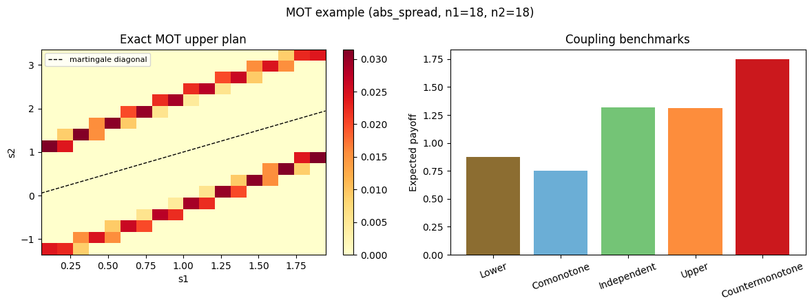

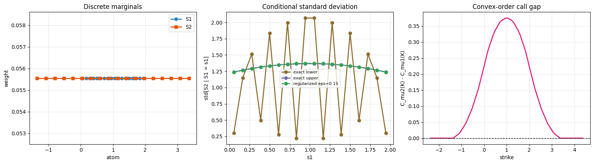

### Files

- [`wide_abs/experiment_report.md`](wide_abs/experiment_report.md)
- [`wide_abs/summary.json`](wide_abs/summary.json)

## Wide put on spread

A downside-oriented payoff on the wider-marginal system, useful for comparison against wide absolute spread.

### Configuration

- `x_interval = (0.0, 2.0)`
- `y_interval = (-1.5, 3.5)`
- `n = 18`
- `payoff = put_on_spread`
- `strike = 0.500000`

### Exact Results

| Lower | Upper | Width |
|---|---|---|
| 0.713319 | 0.938204 | 0.224885 |

### Smallest Regularization Level

| eps | Expected payoff | Bias to upper |
|---|---|---|
| 0.15 | 0.886793 | -0.051411 |

### Figures

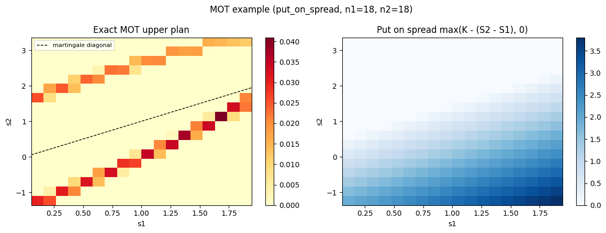

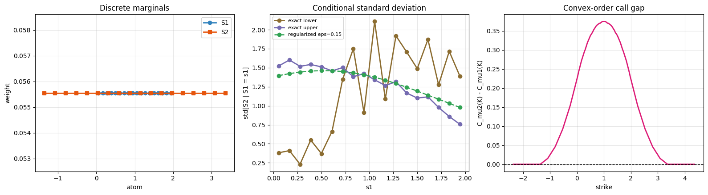

### Files

- [`wide_put/experiment_report.md`](wide_put/experiment_report.md)
- [`wide_put/summary.json`](wide_put/summary.json)

## Broad spread straddle

A straddle-style payoff on the original supports, highlighting symmetric sensitivity around a nonzero strike.

### Configuration

- `x_interval = (1.0, 3.0)`
- `y_interval = (0.0, 4.0)`
- `n = 18`
- `payoff = straddle_on_spread`
- `strike = 0.250000`

### Exact Results

| Lower | Upper | Width |
|---|---|---|
| 0.621678 | 1.019361 | 0.397683 |

### Smallest Regularization Level

| eps | Expected payoff | Bias to upper |
|---|---|---|
| 0.15 | 0.958709 | -0.060651 |

### Figures

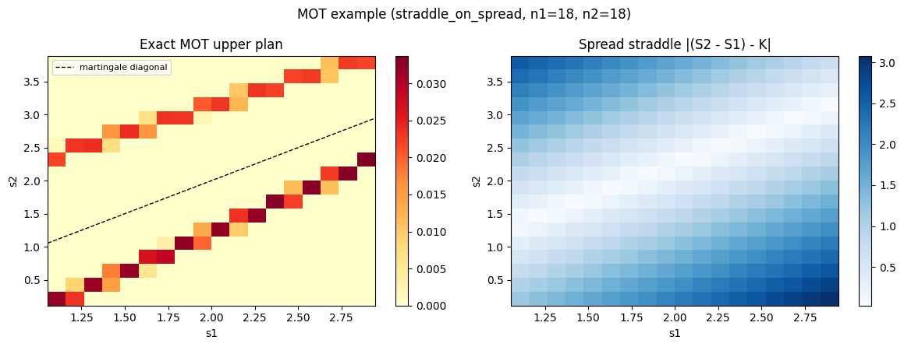

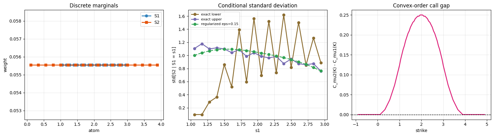

### Files

- [`broad_straddle/experiment_report.md`](broad_straddle/experiment_report.md)
- [`broad_straddle/summary.json`](broad_straddle/summary.json)
