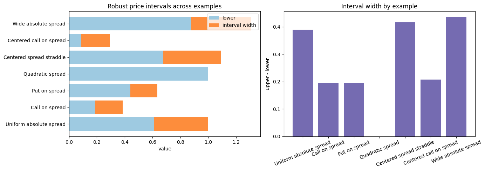
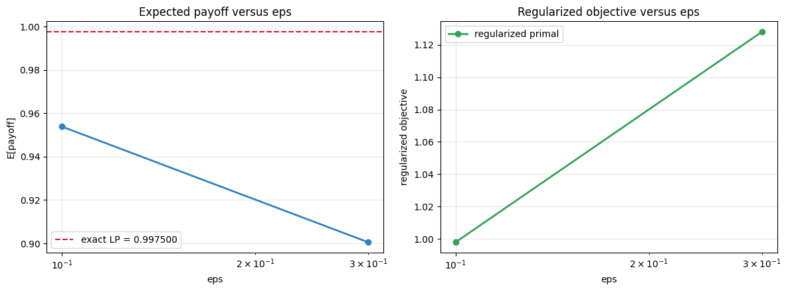
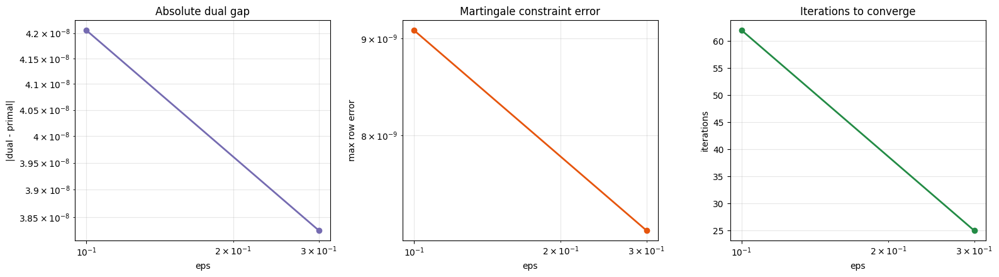
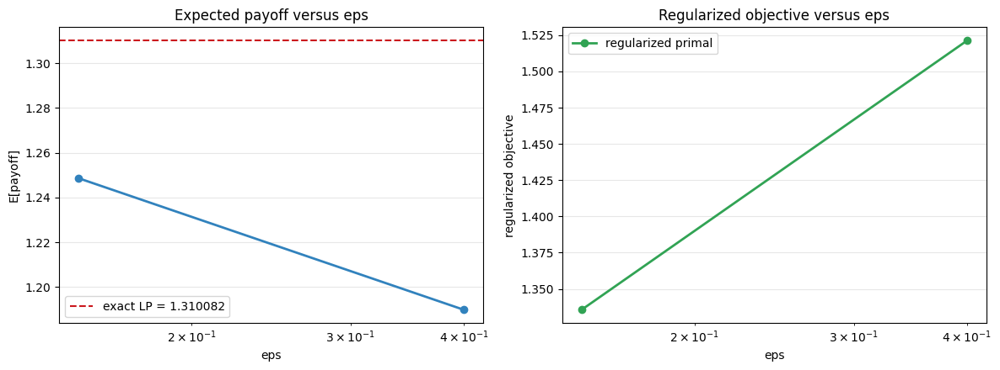
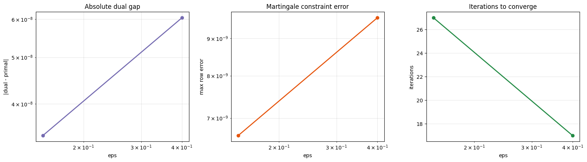

# Examples

I do not like example pages that merely stack images and hope the reader develops feelings. This page is the opposite: each example gets a short interpretation, a numerical summary, and a reason for existing.
{: .lead }

## Gallery Overview

The built-in gallery currently ships seven examples. Together they cover directional payoffs, symmetric payoffs, wider marginals, and one pleasantly rigid quadratic case.

## The Table I Reach For First

| Example | Lower | Upper | Width | Smallest `eps` value |
|---|---:|---:|---:|---:|
| Uniform absolute spread | 0.6087 | 0.9975 | 0.3888 | 0.9538 |
| Call on spread | 0.1894 | 0.3841 | 0.1947 | 0.3469 |
| Put on spread | 0.4394 | 0.6341 | 0.1947 | 0.5969 |
| Quadratic spread | 0.9969 | 0.9969 | 0.0000 | 0.9969 |
| Centered spread straddle | 0.6739 | 1.0894 | 0.4155 | 1.0289 |
| Centered call on spread | 0.0869 | 0.2947 | 0.2078 | 0.2462 |
| Wide absolute spread | 0.8754 | 1.3101 | 0.4347 | 1.2487 |

The machine-readable versions live here:

- [`docs/assets/gallery/gallery_summary.md`](assets/gallery/gallery_summary.md)
- [`docs/assets/gallery/gallery_summary.json`](assets/gallery/gallery_summary.json)

## How I Read These Plots

A few habits keep me honest:

- I treat the exact LP bounds as the benchmark, not the entropic approximation.
- I care about interval width because it tells me how much model uncertainty is still alive after the martingale constraint.
- I watch the small-`eps` value as a convergence story, not as revealed truth.
- If the diagnostics are ugly, I become skeptical before I become impressed.

## Uniform Absolute Spread

This is the reference problem the repo grew out of:

- `S1 ~ Uniform[1, 3]`
- `S2 ~ Uniform[0, 4]`
- payoff `|S2 - S1|`

Numbers that matter:

- lower bound `0.6087`
- upper bound `0.9975`
- interval width `0.3888`
- smallest shipped `eps = 0.1` gives expected payoff `0.9538`

My read: this is the baseline case where the martingale constraint still leaves real room to maneuver. The unrestricted upper benchmark is much larger, so the martingale condition is doing actual work rather than politely standing in the corner.

Reference files:

- [`docs/assets/gallery/uniform_abs_spread/summary.json`](assets/gallery/uniform_abs_spread/summary.json)
- [`docs/assets/gallery/uniform_abs_spread/regularization_path.png`](assets/gallery/uniform_abs_spread/regularization_path.png)
- [`docs/assets/gallery/uniform_abs_spread/stability_diagnostics.png`](assets/gallery/uniform_abs_spread/stability_diagnostics.png)

## Call On Spread

Now I ask for upside spread only:

- payoff `max(S2 - S1 - 0.25, 0)`
- lower bound `0.1894`
- upper bound `0.3841`
- interval width `0.1947`

My read: the interval narrows substantially relative to absolute spread, which makes sense. This payoff only cares about one directional tail, so it gives the optimizer less room to be dramatic. It is a good example of a problem that is still interesting, just less theatrical.

Reference file:

- [`docs/assets/gallery/call_spread/summary.json`](assets/gallery/call_spread/summary.json)

## Put On Spread

This is the directional sibling:

- payoff `max(0.25 - (S2 - S1), 0)`
- lower bound `0.4394`
- upper bound `0.6341`
- interval width `0.1947`

My read: the width matches the call case, but the entire interval is shifted upward. That symmetry-in-width and asymmetry-in-level is exactly the sort of thing I like an example page to expose. The martingale keeps the mean honest; it does not promise emotional fairness between up-moves and down-moves.

Reference file:

- [`docs/assets/gallery/put_spread/summary.json`](assets/gallery/put_spread/summary.json)

## Quadratic Spread

This one uses `(S2 - S1)^2`.

- lower bound `0.9969`
- upper bound `0.9969`
- interval width `0.0000`

My read: this case behaves almost suspiciously well. In the current discrete setup, the lower and upper values agree to four decimals, so the robust interval essentially collapses. It is a useful reminder that not every payoff turns MOT into a grand philosophical crisis.

Reference file:

- [`docs/assets/gallery/quadratic_spread/summary.json`](assets/gallery/quadratic_spread/summary.json)

## Centered Spread Straddle

This example moves to centered marginals and a symmetric spread straddle:

- `S1 ~ Uniform[-1, 1]`
- `S2 ~ Uniform[-2, 2]`
- payoff `|(S2 - S1) - 0.5|`
- lower bound `0.6739`
- upper bound `1.0894`

My read: this is one of the livelier cases in the gallery. The interval is wide, the regularized value still sits meaningfully below the LP upper bound at the smallest shipped `eps`, and the geometry is symmetric enough to make the pictures easier to reason about.

Reference files:

- [`docs/assets/gallery/centered_straddle/summary.json`](assets/gallery/centered_straddle/summary.json)
- [`docs/assets/gallery/centered_straddle/regularization_path.png`](assets/gallery/centered_straddle/regularization_path.png)

## Centered Call On Spread

Same centered marginals, but now the payoff is directional again:

- payoff `max(S2 - S1 - 0.5, 0)`
- lower bound `0.0869`
- upper bound `0.2947`
- interval width `0.2078`

My read: centering the marginals makes the story visually cleaner, but it does not make the problem trivial. I like this example because it shows that a tidy geometry can still leave a nontrivial robust interval.

Reference file:

- [`docs/assets/gallery/centered_call/summary.json`](assets/gallery/centered_call/summary.json)

## Wide Absolute Spread

This is the reference absolute-spread story with a notably wider second marginal:

- `S1 ~ Uniform[0, 2]`
- `S2 ~ Uniform[-1.5, 3.5]`
- payoff `|S2 - S1|`
- lower bound `0.8754`
- upper bound `1.3101`
- interval width `0.4347`

My read: if the reference problem is the clean benchmark, this is the one that says, "fine, let us turn the variance knob and see who blinks first." The upper bound jumps, the interval gets wider, and the regularized path still behaves sensibly. It is a good stress test without becoming numerically melodramatic.

Reference files:

- [`docs/assets/gallery/wide_abs/summary.json`](assets/gallery/wide_abs/summary.json)
- [`docs/assets/gallery/wide_abs/regularization_path.png`](assets/gallery/wide_abs/regularization_path.png)

## Regularization In Practice

When I want to judge whether the entropic solver is behaving, I look at these two families of figures first.

### Uniform Absolute Spread Path

### Uniform Absolute Spread Diagnostics

### Wide Absolute Spread Path

### Centered Straddle Diagnostics

The broad pattern is exactly the one I want:

- the expected payoff moves toward the LP upper value as `eps` shrinks
- smaller `eps` costs more iterations
- constraint errors stay tiny
- the entropic objective is not the same quantity as the raw expected payoff, and pretending otherwise is how notebooks start lying to people

## Final Observation

The gallery is small on purpose, but it is no longer thin. Each example is there to illustrate a different shape of uncertainty: directional, symmetric, variance-driven, or simply wider. That is enough to make the repo feel like a working research notebook rather than a single canned demo.
