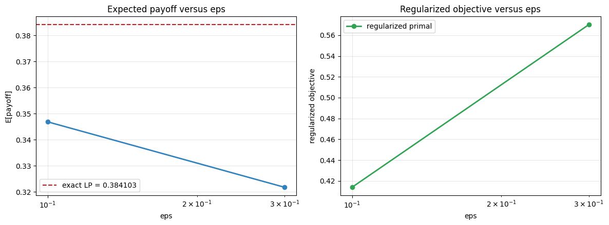
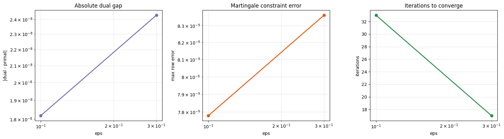
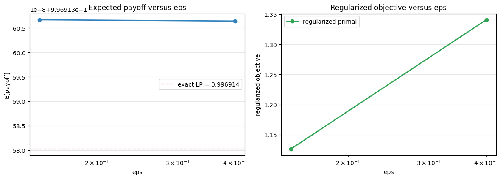
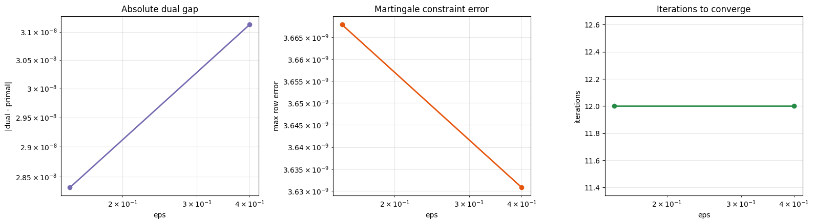

# Examples

## Gallery Overview

The repository now ships with a curated gallery generator that runs multiple interesting experiments and writes both plots and machine-readable summaries.

### Overview Plot

### Summary Files

- [`docs/assets/gallery/gallery_summary.md`](assets/gallery/gallery_summary.md)
- [`docs/assets/gallery/gallery_summary.json`](assets/gallery/gallery_summary.json)

## Uniform Absolute Spread

Parameters:

- `S1 ~ Uniform[1, 3]`
- `S2 ~ Uniform[0, 4]`
- payoff `|S2 - S1|`
- exact martingale constraint

### Exact Summary Plot

### Regularization Path

### Stability Diagnostics

### Summary Data

The underlying machine-readable run summary is stored in:

- [`docs/assets/gallery/uniform_abs_spread/summary.json`](assets/gallery/uniform_abs_spread/summary.json)

## Call-On-Spread

Parameters:

- `S1 ~ Uniform[1, 3]`
- `S2 ~ Uniform[0, 4]`
- payoff `max(S2 - S1 - 0.25, 0)`

### Exact Summary Plot

### Regularization Path

### Stability Diagnostics

### Summary Data

- [`docs/assets/gallery/call_spread/summary.json`](assets/gallery/call_spread/summary.json)

## Quadratic Spread

This example emphasizes variance amplification by using `(S2 - S1)^2` as the payoff.

### Exact Summary Plot

### Regularization Path

### Stability Diagnostics

### Summary Data

- [`docs/assets/gallery/quadratic_spread/summary.json`](assets/gallery/quadratic_spread/summary.json)

## Centered Spread Straddle

This example uses centered supports with a wider second marginal and a spread straddle payoff.

### Exact Summary Plot

### Regularization Path

### Stability Diagnostics

### Summary Data

- [`docs/assets/gallery/centered_straddle/summary.json`](assets/gallery/centered_straddle/summary.json)

## Notes

- The exact solver gives the discrete LP benchmark.
- The regularized solver converges toward the exact result as `eps` decreases.
- The diagnostics plot makes it easier to compare dual gaps, martingale errors, and iteration counts.
- The JSON summaries make it easy to compare runs or feed results into external tooling.
