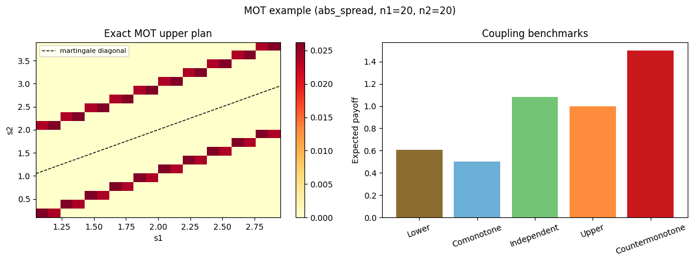
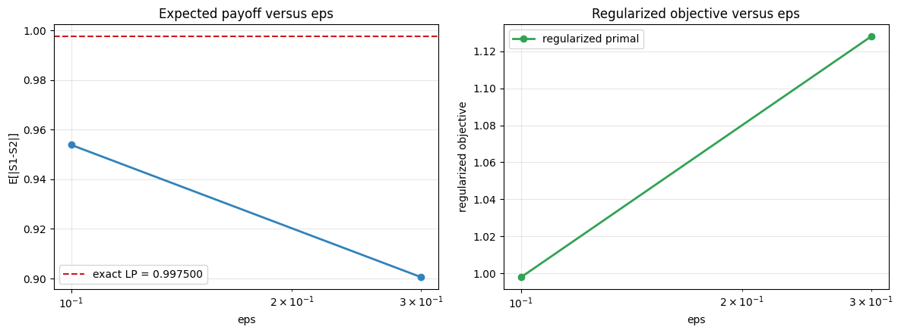

# Examples

## Reference Uniform Abs-Spread Example

Parameters:

- `S1 ~ Uniform[1, 3]`
- `S2 ~ Uniform[0, 4]`
- payoff `|S2 - S1|`
- exact martingale constraint

### Exact Summary Plot

### Regularization Path

### Summary Data

The underlying machine-readable run summary is stored in:

- [`docs/assets/examples/uniform_abs_spread/summary.json`](assets/examples/uniform_abs_spread/summary.json)

## Call-On-Spread Example

Parameters:

- `S1 ~ Uniform[1, 3]`
- `S2 ~ Uniform[0, 4]`
- payoff `max(S2 - S1 - 0.25, 0)`

### Exact Summary Plot

### Regularization Path

### Summary Data

- [`docs/assets/examples/call_spread/summary.json`](assets/examples/call_spread/summary.json)

## Notes

- The exact solver gives the discrete LP benchmark.
- The regularized solver converges toward the exact result as `eps` decreases.
- The JSON summaries make it easy to compare runs or feed results into external tooling.
